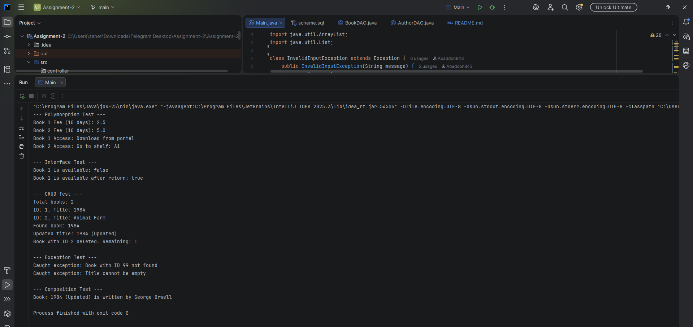

A. Project Overview: Goal and Entities
- Goal
- Demonstrate and perform basic operations with library data: create an author, create an e-book or printed book, get a list of books, get a book by id, delete a book.
- Demonstrate OOP concepts: inheritance, interfaces, polymorphism.

- Key entities (and their relationships)
- Author — the book's author. Fields: id, name, birthYear, nationality.
- Book (an abstract class—a template that cannot be used directly) — common fields: id, title, author, year, isbn.
- EBook — an e-book (a descendant of Book). Additional fields: fileSize, downloadUrl. Implements DigitalAccess (an interface, a set of methods for accessing a file).
- printedBook — a printed book (a descendant of Book). Additional fields: shelfLocation, weight. Implements Borrowable (an interface for borrowing/returning).
- Relationship: Book HAS - A Author (composition - a book contains an author object).

An example of a relationship in code:
```java
Author author = new Author(25, "George Orwell", 1960, "British");
Book ebook = new EBook(24, "1984", author, 1994, "9781234567890", 3.4, "https://example.com"); 
```

B. OOP Design Documentation
- Abstract Classes
- `Book` declares public fields and abstract methods `calculateLateFee(int days)` and `getAccessInstructions()`; subclasses implement these methods differently.
- Interfaces (contract: the set of methods that a class agrees to implement)
- `Borrowable` declares methods `borrow()`, `returnItem()`, and `isAvailable()`.
- `DigitalAccess` declares methods `getDownloadURL()` and `getFileSize()`.
- Inheritance
- `EBook` extends Book`, `printedBook` extends Book`.
- Composition
- The `Book` class contains `Author` — a book cannot be correctly created without an author. - Examples of polymorphism (one method - different behavior)
- Calling `calculateLateFee(10)` for `EBook` and `printedBook` will yield different results:
- EBook: 10 * 0.25
- PrintedBook: 10 * 0.50


C. Database Description
- Database Type: PostgreSQL (using JDBC).
- Tables:

  SQL Insert Examples:
```sql
-- Add an author
INSERT INTO authors (name, birthyear, nationality) VALUES ('Ernest Hemingway', 1899, 'American');

- Add an e-book (assuming author_id = 1)
INSERT INTO books (title, isbn, author_id, publish_year, book_type, download_url, file_size)
VALUES ('Old Man and the Sea', '9780684801223', 1, 1952, 'EBOOK', 'https://books.com/oms', 1.5);

-- add a printed book
INSERT INTO books (title, isbn, author_id, publish_year, book_type, shelf_location, weight, available)
VALUES('Pride and Prejudice', '9780141439518', 1, 1813, 'PRINTED', 'E5-F6', 0.4, TRUE);
```

D. Controller / CRUD
- This tutorial project doesn't have a web controller. Main.java acts as the controller (it calls services and prints the results to the console).
- Operations (CRUD — Create, Read, Update, Delete):
- Create:
- Author: `authorService.createAuthor(new Author(0, "Name", 1970, "Country"))`
- EBook: `bookService.createEBook(new EBook(0, "Title", author, 2000, "isbn", 2.0, "url"))`
- Read:
- `bookService.getAllBooks()` — returns a list of books (List<Book>).
- `bookService.getBookByID(id)` — returns a single book or throws a ResourceNotFoundException (if none).
- Update:
- Main shows an example of an in-memory update (`bookToUpdate.setTitle(oldTitle + " [Updated]")`). The DAO implements the `updateBookByID(...)` method for updating the database.
- Delete:
- `bookService.deleteBookID(id)` — deletes a book (DAO.deleteBookById is called in the service).

Example "request" and expected response in the console:
```text
// In Main:
Author hemingway = new Author(0, "Ernest Hemingway", 1899, "American");
authorService.createAuthor(hemingway);
System.out.println("✓ Author created: Ernest Hemingway");

EBook newEbook = new EBook(0, "Old Man and Sea", dbAuthor, 1952, "9780684801223", 1.5, "https://books.com/oms");
bookService.createEBook(newEbook);
System.out.println("✓ EBook created: Old Man and Sea");

List<Book> allBooks = bookService.getAllBooks();
System.out.println("Total books: " + allBooks.size());
for (Book b : allBooks) { 
System.out.println(" • [ID: " + b.getId() + "] " + b.getTitle() + 
" (" + b.getYear() + ") by " + b.getAuthor().getName());
}
```

Error handling example:
```text
// attempt to get a non-existent book in Main:
try {
bookService.getBookByID(99999);
System.out.println(" ❌ Should have thrown exception!");
} catch (ResourceNotFoundException e) {
System.out.println(" ✓ Caught: " + e.getClass().getSimpleName());
System.out.println(" Message: " + e.getMessage());
}
```

---
E. Assembly and Startup Instructions
1) Requirements:
- Java 11+ (JDK)
- PostgreSQL
- PostgreSQL JDBC driver

2) Database Setup:
- Create the `librarydb` database and the `authors` and `books` tables according to the schema (described above).
- Optional: Run the SQL inserts from section C to add test data.

3) Connection Setup:
- Open `src/utils/DatabaseConnection.java` and adjust if necessary:
- URL (jdbc:postgresql://localhost:5432/librarydb)
- USER (postgres)
- PASSWORD (1234)
- In a real project, it's better to read environment variables.

F. Screenshots


G. Reflection (what I learned, challenges, and advantages of JDBC)
- What I learned:
- Understood the separation of layers: model → service → DAO and why it's important (code cleanliness, testability).
- Hands-on experience with JDBC: prepared statements (PreparedStatement), ResultSet, SQLException handling.
- Saw how to implement OOP patterns: abstract classes, interfaces, composition, and polymorphism in practice.

- Difficulties I encountered:
- Working with JDBC is noticeably low-level: you have to manually map ResultSet columns to objects.
- Connection management: the project creates a new connection for each operation, which is inconvenient and inefficient; I would use a pool (HikariCP).
- Error handling: Initially, the DAO simply logged SQLException and returned null, which made debugging difficult; throwing exception wrappers is better.

- Advantages of using JDBC (practical observations):
- Complete control over SQL (you can write any optimized queries).
- No magic—you can see what's being executed and how, which is useful for learning.
- Easy to start with a small project (without an ORM).

- What could be improved (briefly):
- Move the database configuration to a file/environment variables.
- Introduce a connection pool.
- Add a DTO and REST controller (if creating a web API).
- Improve error handling: wrap SQLExceptions in custom exceptions and return meaningful statuses.

---